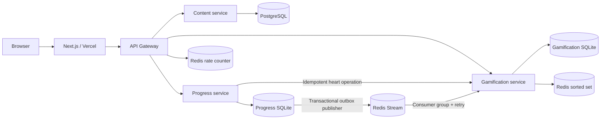
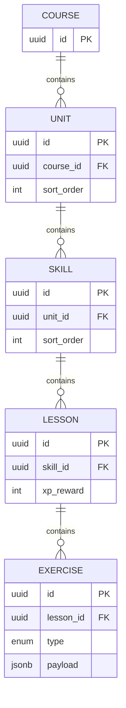
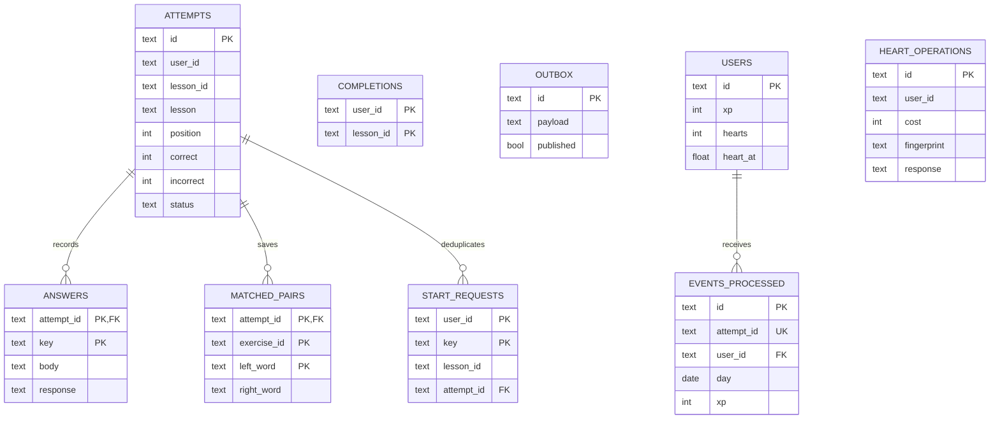

# Duolingo Clone

A Spanish learning app with a Next.js frontend, FastAPI microservices, PostgreSQL curriculum, durable learner databases, and Redis Streams. The learning flow uses real APIs and persisted state.

## Run locally

Install Docker Desktop, start it, then run from this directory:

```bash
docker compose up --build -d
```

Open **http://localhost:3000**. The public gateway is at **http://localhost:8000**. Content migrations and the Spanish seed run automatically. Named volumes preserve curriculum, attempts, rewards, and Redis data across container restarts. `docker compose down` stops the stack without deleting these volumes.

```bash
docker compose ps
docker compose logs --tail=100 content progress gamification gateway
```

To develop the frontend separately, start only the backend and then run Next.js:

```bash
docker compose up --build -d gateway
cd frontend
npm ci
cp .env.example .env.local
npm run dev
```

## Implemented

| Area | Implementation |
| --- | --- |
| Learning path | Zigzag nodes, server-enforced sequential unlocks, completion crowns, skill progress rings |
| Lesson player | Multiple choice, token translation, matching, fill blank, typed answer; server grading, feedback, progress, hearts |
| Dialogs | Lesson complete, out of hearts, save-and-exit |
| Progress | Resumable attempts, answer history, idempotent starts/submissions, durable completion outbox |
| Gamification | XP, UTC streaks, timed heart regeneration, achievements, daily quests |
| Leaderboard | Redis sorted set with real learner XP and labeled seeded competitors |
| Gateway | Allowlisted routing, fixed demo user, Redis rate limit, body limit, upstream error handling |
| Persistence | PostgreSQL content; separate SQLite volumes for progress and gamification; Redis AOF |
| Local stack | Compose, Dockerfiles, migration/seed startup |
| Hosting | Vercel configuration and optional Render Blueprint prepared; **not published** |

Super and most social/profile decoration remain demo placeholders. **Speak practice** (`/practice/speak`) uses the browser Web Speech API with a typed fallback, while **Listen practice** (`/practice/listen`) provides normal and slowed TTS playback with an accessible text fallback. The app does not store recordings, and neither mode deducts hearts; recognition processing depends on the browser. The social suggestions are fixture data; learner XP, hearts, streak, achievements, and quests are live.

## Architecture



Each service owns its database. The gateway is the only public backend service. The Next.js route handler forwards to it using the server-only `GATEWAY_URL`; browsers never need service URLs or credentials. Raw answer-bearing content endpoints are available only on the private service network. Public attempts contain sanitized exercise payloads.

## Schemas





Lesson/user IDs crossing service boundaries are logical references, not cross-database foreign keys. `COMPLETIONS` and `OUTBOX` belong to Progress; `USERS`, `EVENTS_PROCESSED`, and `HEART_OPERATIONS` belong to Gamification.

## Public API

All routes use `/api/v1`, through port 8000 or the frontend's same-origin proxy.

| Method | Route | Purpose |
| --- | --- | --- |
| GET | `/path` | Curriculum with completed/unlocked flags and skill crowns |
| GET | `/courses`, `/courses/{id}` | Course catalog |
| GET | `/skills/{id}/lessons` | Lesson metadata |
| POST | `/attempts` | Start/resume: `{ "lesson_id": "UUID" }` |
| GET | `/attempts/{id}` | Saved position and sanitized lesson snapshot |
| POST | `/attempts/{id}/answers` | Submit `{ "exercise_id": "UUID", "answer": ... }` |
| POST | `/practice/legendary` | Start an idempotent timed practice session: `{ "duration_seconds": 15–600 }` |
| POST | `/practice/legendary/{id}/answers` | Grade the current timed exercise; the server rejects stale answers and awards its 15 XP reward once |
| GET | `/me` | XP, streak, hearts, next regeneration time, achievements, quests |
| GET | `/leaderboard` | All-time ranking with seeded competitor labels |
| GET | `/health` | Gateway health and Redis availability (outside `/api/v1`) |

POST requests require an `Idempotency-Key` header (1–128 characters). Replaying the same key/body returns the saved result. Reusing a key with different content returns 409. The UI retains pending submissions and their keys in session storage, enabling retries after ambiguous network failures. Service-level OpenAPI is at `/docs` on each private service; the public gateway exposes an allowlisted proxy and its own `/docs`.

Answer shapes:

| Type | `answer` |
| --- | --- |
| `multiple_choice` | Zero-based integer option index |
| `translate` | Ordered array of Spanish tokens |
| `match` | Object mapping each left word to a right word |
| `fill_blank` | String |
| `type_answer` | String |

The matching UI uses two columns of tappable word tiles. It submits one pair at a time with `"match_pair": true` and `"answer": {"apple": "manzana"}` alongside `exercise_id`. Pair responses include `matched_pairs` and `exercise_complete`; saved pairs also appear when resuming an attempt. Correct pairs lock and fade, incorrect pairs cost a heart, and Continue enables after all pairs match. Retries reuse the idempotency key. Full-map matching submissions remain supported.

Incorrect answers stay on the current exercise and cost one heart. Every exercise must be answered correctly to complete a lesson. Text comparison uses Unicode NFC, case folding, and collapsed whitespace; accents are significant unless the seed explicitly accepts an unaccented variant. Invalid input returns 422; locked lessons/out of hearts return 403; stale submissions return 409; rate limit returns 429 with `Retry-After`; unavailable upstreams return 503.

## Delivery and correctness

1. Progress snapshots the lesson when starting an attempt. One learner has at most one active attempt; starting a different unlocked lesson abandons the previous active attempt. Returning to the same active lesson resumes it.
2. Each submission is serialized in a database transaction. Progress grades the answer, then calls an idempotent internal heart operation. The operation ID derives from attempt/position/error count and checks the request fingerprint. If the heart transaction succeeds but the response is lost, retrying the same answer cannot charge again.
3. The last correct answer commits the attempt, unique lesson completion, saved response, and `LessonCompleted` outbox record in one transaction.
4. The publisher retries unpublished records. A crash between Redis `XADD` and marking published may duplicate the event; this is intentional at-least-once delivery.
5. Gamification deduplicates by both event UUID and attempt UUID, commits reward state, updates Redis with absolute XP scores, and only then acknowledges. Pending stream deliveries are reclaimed after failure. Rebuilding the leaderboard from durable users is safe.

Progress is immediately consistent; XP/streak/quests are eventually consistent, normally within a few seconds. The UI polls learner data every 15 seconds. Delivery failures are logged and retried. Databases and Redis must be backed up together; a total Redis disk loss can lose already-published but unconsumed events, even though ordinary process/container restarts are recoverable.

## Assumptions and tradeoffs

- One fixed mocked user (`aaaaaaaa-aaaa-aaaa-aaaa-aaaaaaaaaaaa`), as requested. Incoming user headers are ignored at the gateway. All visitors share this demo learner; authentication and per-visitor accounts are outside this implementation. With `SEED_DEMO_LEARNER=true` (Compose default), that learner starts with both Greetings lessons completed, 20 XP, and a 2-day streak so the path and profile are immediately demoable.
- One Spanish course, two units, five skills, six lessons, nine seeded exercises covering all five types. Curriculum is read-only after seed.
- First completion grants the lesson's configured XP; later practice completions grant 5 XP. Completing a lesson advances the streak regardless of mistakes.
- Streaks and daily quests use UTC dates, including delayed/out-of-order events. Yesterday's streak remains visible until the current day is missed. Quests are progress goals, with no extra currency or claim action.
- Hearts cap at five and regenerate every 30 minutes. Regeneration is computed from a persisted timestamp on reads/mutations, so downtime does not stop recovery.
- Rings show completed lessons within each skill; crowns represent completed lessons. The leaderboard is all-time, with five static demo competitors; weekly leagues are not implemented.
- SQLite WAL keeps each learner service small and durable for one process/replica on persistent local disk. Transactions serialize writes and hold a lock during heart requests. This is suitable for the assignment, not high write throughput or horizontal scaling; migrate these stores to PostgreSQL for that.
- Progress/gamification schema v1 is installed idempotently at startup. Content uses Alembic. Future learner schema changes need versioned migrations.
- Redis uses AOF and no application stream trimming. The gateway permits 120 requests per minute per fixed demo user, with an atomic expiring counter. Redis failure returns 503 instead of bypassing the limit.
- Microservices demonstrate ownership and at-least-once delivery, at the cost of latency, retries, and operational complexity.

## Verification

```bash
python -m venv .venv
.venv/bin/pip install -r backend/requirements-dev.txt
.venv/bin/python -m pytest backend/tests -q
cd frontend
npm ci
npm run lint
npm run build
```

Backend tests use temporary on-disk databases, real FastAPI handlers, fixture curriculum transport, and fake Redis. They cover all five graders, locking, identity isolation, idempotency conflicts, concurrent retries, heart exhaustion/regeneration, a lost heart response, durable restart state, outbox failure/replay, pending event recovery, UTC streaks, leaderboard, and gateway rate limits. These tests do not replace a real PostgreSQL/Redis/Compose smoke test.

Verification completed in this workspace: 19 backend tests; 6 browser contract tests with controlled API responses, including mobile/desktop matching, reload persistence, and failed-request retries; frontend ESLint and TypeScript. A production Webpack build passed before the matching update. Compose configuration validates. The full container build failed and its retry was not approved, so real PostgreSQL/Redis/Compose integration and the hosted deployment remain unverified.

For browser tests against a running stack, see [frontend/README.md](frontend/README.md). Deployment instructions and current limitations are in [DEPLOYMENT.md](DEPLOYMENT.md).

### High-priority regression cases

`backend/tests/test_critical_scenarios.py` adds two P0 scenarios:

1. **Concurrent final-answer submissions:** eight synchronized requests across four idempotency keys must save exactly one completion/event, award XP once, preserve hearts, and unlock the next lesson.
2. **Delivery failures after commits:** lose the Redis publish response, then fail leaderboard projection after the reward commit. Recovery must handle duplicate events, rebuild the ranking, and acknowledge pending deliveries without doubling XP, streak, or quest progress.

Both use temporary SQLite databases and fake Redis with injected failures; they do not require Docker or modify the demo learner.
