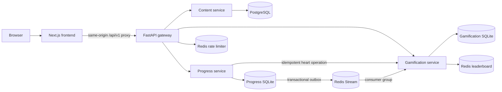
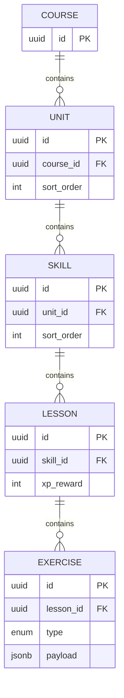
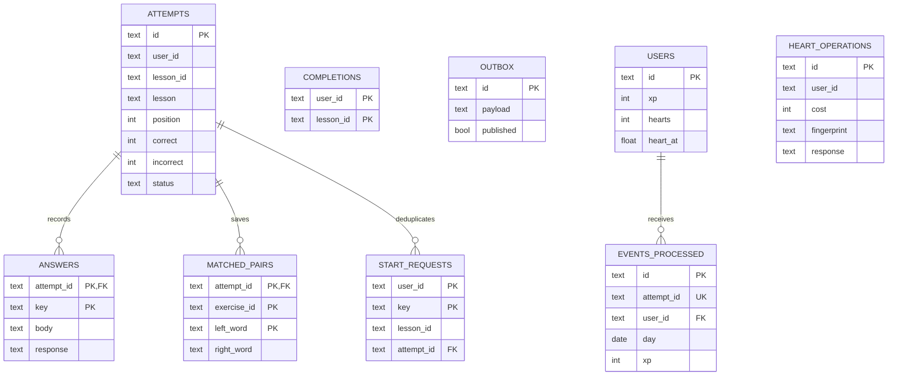

# Duolingo Clone

A full-stack Spanish learning application inspired by Duolingo. It combines a responsive Next.js interface with a FastAPI microservice backend, a PostgreSQL curriculum store, learner state in Progress/Gamification, and Redis-backed messaging, rate limiting, and rankings. Lessons use real APIs: answers are graded on the server, hearts are charged safely, completed lessons unlock the path, and XP updates through the reward pipeline. See [Hosted demo](#hosted-demo) for live URLs and Free-tier persistence limits.

> This is an educational clone built for a full-stack assignment. It is not affiliated with or endorsed by Duolingo.

## Contents

- [Features](#features)
- [Hosted demo](#hosted-demo)
- [Architecture](#architecture)
- [Why PostgreSQL, Redis, and Docker?](#why-postgresql-redis-and-docker)
- [Project structure](#project-structure)
- [Run locally](#run-locally)
- [Frontend routes](#frontend-routes)
- [Backend services](#backend-services)
- [Public API](#public-api)
- [Persistence and event delivery](#persistence-and-event-delivery)
- [Render free-plan notes](#render-free-plan-notes)
- [Testing](#testing)
- [Assumptions and limitations](#assumptions-and-limitations)

## Features

| Area | Implementation |
| --- | --- |
| Learning path | Responsive zigzag path, server-enforced sequential unlocks, completion crowns, and skill progress rings |
| Lesson player | Multiple choice, token translation, tap-to-match columns, fill-in-the-blank, and typed answers |
| Lesson state | Server grading, progress bar, hearts, feedback bar, save-and-exit, completion, and out-of-hearts dialogs |
| Progress | Resumable attempts, saved matching pairs, answer history, idempotent writes, and a transactional completion outbox |
| Gamification | Live XP, UTC streaks, timed heart regeneration, achievements, one-time badge celebrations, and daily quests |
| Practice | Standard practice hub, timed Legendary sessions, listening practice, and speech practice with typed fallbacks |
| Leaderboard | Redis sorted set containing the real demo learner and labeled seeded competitors |
| Gateway | Allowlisted proxy routes, fixed assignment user, request-size protection, Redis rate limiting, and upstream error handling |
| UI polish | Desktop and mobile layouts, animations, accessible custom toasts, live navigation stats, badge grid, and empty/demo states |

Super subscriptions, payments, and production authentication are outside the assignment scope. Social suggestions, shop currency, and some profile decoration are presentation fixtures.

## Hosted demo

| Role | URL |
| --- | --- |
| Frontend (Vercel) — open this | https://duolingo-clone-vyoum.vercel.app |
| Gateway (public API) | https://gateway-b711.onrender.com |
| Gateway health | https://gateway-b711.onrender.com/health |
| Content health | https://content-3q6p.onrender.com/health |
| Progress health | https://progress-bhef.onrender.com/health |
| Gamification health | https://gamification-b7nt.onrender.com/health |

The browser should only use the Vercel app. Next.js proxies `/api/v1` to the gateway. Content, Progress, and Gamification health links are for evaluation transparency; bare service roots return FastAPI `{"detail":"Not Found"}` because they have no homepage.

**Database (what is shipped today)**

- **Content** uses PostgreSQL locally and in production (Alembic migrations, JSONB exercise payloads, shared read catalog).
- **Progress** and **Gamification** use SQLite. Locally, Compose named volumes keep learner data across restarts. On Render Free they sit on an ephemeral filesystem, so a redeploy or platform restart during evaluation can reset XP, streak, hearts, and completions. The Postgres curriculum survives those events.
- Managed Postgres for Progress/Gamification (for example Neon) is the correct durable fix. It is identified below as a planned migration and was scoped out of this submission for time.

**Hosting**

All four backend services run on Render Free. During the evaluation window they are kept warm with periodic `/health` pings (~every 13 minutes). If a service has gone idle, the first load can take ~30–60 seconds, or show **Getting your lessons ready…** when `WARMUP_ENABLED=true`. Refresh or Retry once if needed.

## Architecture



The gateway is the only public backend service. The browser calls the Next.js catch-all route at `/api/v1/*`; that server-side route forwards to `GATEWAY_URL`. Internal service addresses, answer-bearing curriculum endpoints, and heart mutation endpoints are therefore not exposed to the browser.

Each backend service owns its data. Content owns the curriculum, Progress owns attempts and completions, and Gamification owns hearts and rewards. Cross-service IDs are logical references rather than database foreign keys.

## Why PostgreSQL, Redis, and Docker?

**PostgreSQL** stores structured course content: courses, units, skills, lessons, and exercises. These records have ordered relationships and foreign-key constraints, while exercise bodies need PostgreSQL `JSONB` for different question shapes. Alembic provides a repeatable schema migration, and the seed command creates the same Spanish curriculum in every environment.

**Redis** serves three jobs that do not fit a relational query path well:

1. A Redis Stream transports `LessonCompleted` events from Progress to Gamification.
2. A sorted set provides fast leaderboard ranking by XP.
3. An expiring atomic counter enforces the gateway's per-minute rate limit.

Redis is not the source of truth for learner rewards. Gamification persists processed event IDs and reward state before acknowledging a stream message, which makes duplicate delivery safe. Redis AOF is enabled in local Compose to retain stream and leaderboard data across ordinary container restarts.

**Docker Compose** starts the six-process local system with compatible versions, private service DNS, health checks, startup ordering, environment variables, and named volumes. Reviewers need only Docker Desktop rather than separate PostgreSQL, Redis, Python, and Node installations. Docker is a packaging and local orchestration choice; it does not replace PostgreSQL or Redis and it does not require API keys.

Progress and Gamification use separate SQLite databases in this assignment implementation (`sqlite3` + `DB_PATH`, not SQLAlchemy). That keeps each service small and matches the brief’s SQLite expectation for learner state. Local Compose mounts durable volumes for those files. On Render Free without a persistent disk, the same files are ephemeral: sleep alone may keep process memory briefly, but a redeploy or platform restart wipes them. Curriculum Postgres is separate and survives.

### Planned migration (scoped out of this submission)

To make hosted learner persistence match the assignment’s “progress must persist” bar on Free hosting:

1. Provision managed Postgres for Progress and Gamification (Neon is the preferred free option because this workspace already uses Render’s single Free Postgres for Content).
2. Replace the shared `sqlite3` transaction helper with a Postgres-backed store (or SQLAlchemy) and adapt SQLite-specific SQL (`INSERT OR IGNORE`, partial unique indexes, quoted identifiers).
3. Point each service at its `DATABASE_URL`, run schema create/migrate on startup, redeploy, and re-verify path unlocks, XP, streak, and hearts across a forced Render restart.

This is a real code change, not an env-only swap. It was deferred after the live demo, warmup, and evaluation keep-warm path were in place.

## Project structure

```text
.
├── frontend/                         Next.js application and Playwright tests
├── backend/
│   ├── services/
│   │   ├── content-service/          PostgreSQL curriculum API, Alembic, seed
│   │   ├── progress-service/         Attempts, grading, unlocks, outbox
│   │   ├── gamification-service/     XP, streaks, hearts, badges, quests
│   │   ├── gateway/                  Public routing, identity, rate limit
│   │   └── shared/                   Shared exercise and runtime contracts
│   └── tests/                        Backend integration/regression tests
├── docker-compose.yml                Complete local stack
├── render.yaml                       Optional paid Render Blueprint
└── DEPLOYMENT.md                     Hosted deployment checklist
```

## Run locally

Prerequisites are Docker Desktop with Compose v2 and roughly 5–10 GB of free disk space for images, build layers, containers, and volumes. No PostgreSQL password, Redis API key, or local Python/Node installation is needed for the Compose path.

Start Docker Desktop, wait until its engine is running, and run from the repository root:

```bash
docker compose up --build -d
```

Open **http://localhost:3000**. The public gateway is at **http://localhost:8000**. Content migrations and the Spanish seed run automatically. Named volumes preserve curriculum, attempts, rewards, and Redis data across container restarts. `docker compose down` stops the stack without deleting these volumes.

```bash
docker compose ps
docker compose logs --tail=100 content progress gamification gateway
```

Stop the application without deleting learner data:

```bash
docker compose down
```

To intentionally reset all local curriculum and learner state, remove the named volumes as well:

```bash
docker compose down --volumes
```

To develop the frontend separately, start only the backend and then run Next.js:

```bash
docker compose up --build -d gateway
cd frontend
npm ci
cp .env.example .env.local
npm run dev
```

## Local smoke test

With Docker Desktop running, build and start the complete stack:

```bash
docker compose config -q
docker compose up --build -d
docker compose ps
```

Every service should be running and PostgreSQL/Redis should report healthy. Check the public boundary and UI:

```bash
curl --fail http://localhost:8000/health
curl --fail http://localhost:8000/api/v1/me
curl --fail http://localhost:8000/api/v1/path
curl --fail http://localhost:3000
```

Run the real-stack browser test. It completes seeded lessons and intentionally leaves the demo learner progressed:

```bash
cd frontend
PLAYWRIGHT_BASE_URL=http://localhost:3000 PLAYWRIGHT_CHANNEL=chrome npx playwright test tests/learning.spec.ts
cd ..
```

Verify persistence by recording the learner response, restarting the stateful services, and reading it again:

```bash
curl --fail http://localhost:8000/api/v1/me
docker compose restart progress gamification redis
docker compose ps
curl --fail http://localhost:8000/api/v1/me
curl --fail http://localhost:8000/api/v1/path
```

The XP, streak, hearts, completed lessons, and unlocked path must survive the restart. If a check fails, inspect bounded logs with `docker compose logs --tail=150 content progress gamification gateway frontend redis postgres`.

## Frontend routes

| Route | Screen and behavior |
| --- | --- |
| `/` | Main learning path with live crowns, rings, unlock state, XP, streak, and hearts |
| `/lesson/{lessonId}` | Five-type lesson player with persisted attempts, feedback, hearts, and completion dialogs |
| `/practice` | Practice hub linking to listening, speaking, and timed modes |
| `/practice/legendary` | Configurable countdown practice with server sessions, timeout handling, and one-time rewards |
| `/practice/listen` | Browser text-to-speech practice with normal/slow playback and accessible fallback text |
| `/practice/speak` | Browser speech-recognition practice with a typed fallback; recordings are not stored |
| `/leaderboard` | Redis-backed all-time XP ranking |
| `/quests` | Live daily quest progress from Gamification |
| `/profile` | Live learner statistics and locked/unlocked badge grid; social data is illustrative |
| `/shop` | Assignment UI for heart-related and placeholder shop actions; there is no payment processing |
| `/login` | Visual demo login; the backend intentionally uses one mocked learner |
| `/api/v1/{path}` | Server-side Next.js proxy to the public gateway; not a screen |

Listen and Speak depend on browser media capabilities. They do not deduct hearts. Legendary uses seeded exercises from Content, rejects stale submissions, treats timeout as failure, and awards its XP only once.

## Backend services

| Service | Local address | Responsibility | Storage |
| --- | --- | --- | --- |
| Frontend | `http://localhost:3000` | Next.js UI and same-origin API proxy | None |
| Gateway | `http://localhost:8000` | Public allowlist, mocked user, 16 KB body limit, rate limiting, upstream routing | Redis counters |
| Content | Private `content:8001` | Course tree and seeded lesson/exercise content | PostgreSQL |
| Progress | Private `progress:8000` | Path state, attempts, grading, matching pairs, timed sessions, completion outbox | SQLite volume |
| Gamification | Private `gamification:8000` | XP, streaks, hearts, achievements, quests, leaderboard projection | SQLite volume + Redis |
| Redis | Private `redis:6379` | Stream, sorted set, and expiring rate-limit keys | AOF volume locally |

Content exposes `/health`, `/api/v1/courses`, `/api/v1/courses/{id}`, `/api/v1/skills/{id}/lessons`, `/api/v1/lessons/{id}`, and `/api/v1/lessons/{id}/exercises` on the private network. The final two include answer-bearing exercise content and are deliberately absent from the gateway allowlist. Progress and Gamification also expose `/health`; Gamification's `/internal/hearts` and `/internal/practice-rewards` are private service-to-service endpoints.

## Schemas





Lesson/user IDs crossing service boundaries are logical references, not cross-database foreign keys. `COMPLETIONS` and `OUTBOX` belong to Progress; `USERS`, `EVENTS_PROCESSED`, and `HEART_OPERATIONS` belong to Gamification.

## Public API

All routes use `/api/v1`, through port 8000 or the frontend's same-origin proxy.

| Method | Route | Purpose |
| --- | --- | --- |
| GET | `/path` | Curriculum with completed/unlocked flags and skill crowns |
| GET | `/courses`, `/courses/{id}` | Course catalog |
| GET | `/skills/{id}/lessons` | Lesson metadata |
| POST | `/attempts` | Start/resume: `{ "lesson_id": "UUID" }` |
| GET | `/attempts/{id}` | Saved position and sanitized lesson snapshot |
| POST | `/attempts/{id}/answers` | Submit `{ "exercise_id": "UUID", "answer": ... }` |
| POST | `/practice/legendary` | Start an idempotent timed practice session: `{ "duration_seconds": 15–600 }` |
| GET | `/practice/legendary/{id}` | Resume a timed session and receive its current server-authoritative state |
| POST | `/practice/legendary/{id}/answers` | Grade the current timed exercise; the server rejects stale answers and awards its 15 XP reward once |
| GET | `/me` | XP, streak, hearts, next regeneration time, achievements, quests |
| GET | `/leaderboard` | All-time ranking with seeded competitor labels |
| GET | `/health` | Gateway health and Redis availability (outside `/api/v1`) |

POST requests require an `Idempotency-Key` header (1–128 characters). Replaying the same key/body returns the saved result. Reusing a key with different content returns 409. The UI retains pending submissions and their keys in session storage, enabling retries after ambiguous network failures. Service-level OpenAPI is at `/docs` on each private service; the public gateway exposes an allowlisted proxy and its own `/docs`.

Answer shapes:

| Type | `answer` |
| --- | --- |
| `multiple_choice` | Zero-based integer option index |
| `translate` | Ordered array of Spanish tokens |
| `match` | Object mapping each left word to a right word |
| `fill_blank` | String |
| `type_answer` | String |

The matching UI uses two columns of tappable word tiles. It submits one pair at a time with `"match_pair": true` and `"answer": {"apple": "manzana"}` alongside `exercise_id`. Pair responses include `matched_pairs` and `exercise_complete`; saved pairs also appear when resuming an attempt. Correct pairs lock and fade, incorrect pairs cost a heart, and Continue enables after all pairs match. Retries reuse the idempotency key. Full-map matching submissions remain supported.

Incorrect answers stay on the current exercise and cost one heart. Every exercise must be answered correctly to complete a lesson. Text comparison uses Unicode NFC, case folding, and collapsed whitespace; accents are significant unless the seed explicitly accepts an unaccented variant. Invalid input returns 422; locked lessons/out of hearts return 403; stale submissions return 409; rate limit returns 429 with `Retry-After`; unavailable upstreams return 503.

## Persistence and event delivery

1. Progress snapshots the lesson when starting an attempt. One learner has at most one active attempt; starting a different unlocked lesson abandons the previous active attempt. Returning to the same active lesson resumes it.
2. Each submission is serialized in a database transaction. Progress grades the answer, then calls an idempotent internal heart operation. The operation ID derives from attempt/position/error count and checks the request fingerprint. If the heart transaction succeeds but the response is lost, retrying the same answer cannot charge again.
3. The last correct answer commits the attempt, unique lesson completion, saved response, and `LessonCompleted` outbox record in one transaction.
4. The publisher retries unpublished records. A crash between Redis `XADD` and marking published may duplicate the event; this is intentional at-least-once delivery.
5. Gamification deduplicates by both event UUID and attempt UUID, commits reward state, updates Redis with absolute XP scores, and only then acknowledges. Pending stream deliveries are reclaimed after failure. Rebuilding the leaderboard from durable users is safe.

Progress is immediately consistent; XP/streak/quests are eventually consistent, normally within a few seconds. The UI polls learner data every 15 seconds. Delivery failures are logged and retried. Databases and Redis must be backed up together; a total Redis disk loss can lose already-published but unconsumed events, even though ordinary process/container restarts are recoverable.

## Render free-plan notes

### What is deployed today

| Service | Live origin / health | Data store on Free |
| --- | --- | --- |
| Frontend | https://duolingo-clone-vyoum.vercel.app | N/A (Vercel) |
| Gateway | https://gateway-b711.onrender.com · [/health](https://gateway-b711.onrender.com/health) | Redis rate limit |
| Content | [/health](https://content-3q6p.onrender.com/health) | Render Free PostgreSQL (curriculum) |
| Progress | [/health](https://progress-bhef.onrender.com/health) | SQLite on ephemeral disk |
| Gamification | [/health](https://gamification-b7nt.onrender.com/health) | SQLite on ephemeral disk |

**Persistence caveat (honest):** local Compose volumes make Progress/Gamification durable across container restarts. On this Free Render deployment, SQLite can reset after redeploy or platform restart. Periodic `/health` pings (~every 13 minutes) during evaluation reduce idle sleep and cold starts; they do **not** survive a redeploy wipe. Neon (or another managed Postgres) for those two services is the planned durable fix — see [Planned migration](#planned-migration-scoped-out-of-this-submission).

### Automatic startup for anytime evaluation

The frontend supports parallel health probes and a startup screen for sleeping Render services. In Vercel, set these **server-only** environment variables, then **redeploy** (env changes do not apply to an old build):

```dotenv
WARMUP_ENABLED=true
GATEWAY_URL=https://gateway-b711.onrender.com
CONTENT_HEALTH_URL=https://content-3q6p.onrender.com/health
PROGRESS_HEALTH_URL=https://progress-bhef.onrender.com/health
GAMIFICATION_HEALTH_URL=https://gamification-b7nt.onrender.com/health
```

`GATEWAY_URL` is the service origin (no `/health`, no `/api/v1`). The three `*_HEALTH_URL` values must end in `/health` and return JSON with `status: "ok"`. `/api/warmup` probes them concurrently with four-second timeouts and never returns those addresses to the browser. The startup screen retries for approximately two minutes, then offers Retry. This is on-demand wakeup, not a substitute for keep-alive pings.

Temporary network failures and HTTP 502/503/504 responses receive at most two additional API attempts with exponential backoff. Writes are retried only when they carry an idempotency key. Warm-up is disabled by default locally. It does not make Free SQLite durable.

To exercise startup UI and retry safety locally, start Next with `WARMUP_ENABLED=true npm run dev`, then run `WARMUP_ENABLED=true PLAYWRIGHT_CHANNEL=chrome npx playwright test tests/warmup.spec.ts` from `frontend`.

The checked-in [`render.yaml`](render.yaml) is an **optional paid Blueprint** (persistent disks for SQLite, paid Redis/Postgres plans). The live demo above was assembled manually on Free web services instead.

Free-plan reminders:

- One Free Render Postgres per workspace (used here by Content). Extra learner databases need Neon or another provider, or paid disks.
- Free Redis is in-memory; restarts can clear streams/leaderboard cache (rewards remain in SQLite until that file is wiped).
- Free web services sleep after ~15 minutes idle; first request after idle can take ~30–60 seconds or show the warmup screen.
- Prefer exposing only the gateway to end users; health URLs above are for reviewers.

Dockerfiles are still useful on Render because each service gets a reproducible Python runtime and start command. Docker Compose itself is for local orchestration; Render starts the deployed services individually and connects them using environment variables.

Required hosted configuration:

| Variable | Used by | Meaning |
| --- | --- | --- |
| `GATEWAY_URL` | Next.js | Public gateway origin, without `/api/v1` |
| `DATABASE_URL` | Content | PostgreSQL connection string; plain Render URLs are normalized for `asyncpg` |
| `REDIS_URL` | Gateway, Progress, Gamification | Redis connection URL, including credentials when required |
| `CONTENT_URL` | Gateway, Progress | Private Content origin |
| `PROGRESS_URL` | Gateway | Private Progress origin |
| `GAME_URL` | Gateway, Progress | Private Gamification origin |
| `MOCK_USER_ID` | Gateway | Fixed assignment learner UUID |
| `RUN_SEED_ON_STARTUP` | Content | Runs the idempotent Spanish curriculum seed at startup |
| `SEED_DEMO_LEARNER` | Progress, Gamification | Seeds visible demo progress and reward state |
| `RATE_LIMIT` | Gateway | Requests allowed per fixed learner per minute; default `120` |

Do not commit connection URLs or credentials. Configure them in Render/Vercel environment settings. See [`DEPLOYMENT.md`](DEPLOYMENT.md) for the deployment and release checklist.

## Assumptions and limitations

- One fixed mocked user (`aaaaaaaa-aaaa-aaaa-aaaa-aaaaaaaaaaaa`), as requested. Incoming user headers are ignored at the gateway. All visitors share this demo learner; authentication and per-visitor accounts are outside this implementation. With `SEED_DEMO_LEARNER=true` (Compose default), that learner starts with both Greetings lessons completed, 20 XP, and a 2-day streak so the path and profile are immediately demoable.
- One Spanish course, two units, five skills, six lessons, nine seeded exercises covering all five types. Curriculum is read-only after seed.
- First completion grants the lesson's configured XP; later practice completions grant 5 XP. Completing a lesson advances the streak regardless of mistakes.
- Streaks and daily quests use UTC dates, including delayed/out-of-order events. Yesterday's streak remains visible until the current day is missed. Quests are progress goals, with no extra currency or claim action.
- Hearts cap at five and regenerate every 30 minutes. Regeneration is computed from a persisted timestamp on reads/mutations, so downtime does not stop recovery.
- Rings show completed lessons within each skill; crowns represent completed lessons. The leaderboard is all-time, with five static demo competitors; weekly leagues are not implemented.
- SQLite WAL keeps each learner service small for one process/replica. Locally it is durable via Compose volumes. On Render Free without a disk, redeploy/restart can wipe Progress/Gamification state (see Hosted demo). Planned fix: Neon/Postgres migration documented above.
- Progress/gamification schema v1 is installed idempotently at startup with raw SQL. Content uses Alembic + SQLAlchemy. These are not a single DB-agnostic ORM layer today.
- Evaluation keep-warm uses ~13-minute `/health` pings for a short window after submission so cold starts are less likely for reviewers.
- Redis uses AOF and no application stream trimming. The gateway permits 120 requests per minute per fixed demo user, with an atomic expiring counter. Redis failure returns 503 instead of bypassing the limit.
- Microservices demonstrate ownership and at-least-once delivery, at the cost of latency, retries, and operational complexity.

## Testing

```bash
python -m venv .venv
.venv/bin/pip install -r backend/requirements-dev.txt
.venv/bin/python -m pytest backend/tests -q
cd frontend
npm ci
npm run lint
npm run build
npm run test:e2e
```

Backend tests use temporary on-disk databases, real FastAPI handlers, fixture curriculum transport, and fake Redis. They cover all five graders, locking, identity isolation, idempotency conflicts, concurrent retries, heart exhaustion/regeneration, a lost heart response, durable restart state, outbox failure/replay, pending event recovery, UTC streaks, leaderboard, and gateway rate limits. These tests do not replace a real PostgreSQL/Redis/Compose smoke test.

Current suite: **21 backend tests** and **13 Playwright browser tests**. The backend suite and frontend ESLint pass in this workspace. The browser tests cover lesson UI states, mobile and desktop matching, reload persistence, retry behavior, badge celebrations, speech/listening fallbacks, timed practice, animations, and custom toasts. `docker compose config -q` validates the Compose file. A complete container smoke test still requires a responsive local Docker engine, and hosted deployment remains environment-dependent.

For browser tests against a running stack, see [frontend/README.md](frontend/README.md). Deployment instructions and current limitations are in [DEPLOYMENT.md](DEPLOYMENT.md).

### High-priority regression cases

`backend/tests/test_critical_scenarios.py` adds two P0 scenarios:

1. **Concurrent final-answer submissions:** eight synchronized requests across four idempotency keys must save exactly one completion/event, award XP once, preserve hearts, and unlock the next lesson.
2. **Delivery failures after commits:** lose the Redis publish response, then fail leaderboard projection after the reward commit. Recovery must handle duplicate events, rebuild the ranking, and acknowledge pending deliveries without doubling XP, streak, or quest progress.

Both use temporary SQLite databases and fake Redis with injected failures; they do not require Docker or modify the demo learner.
